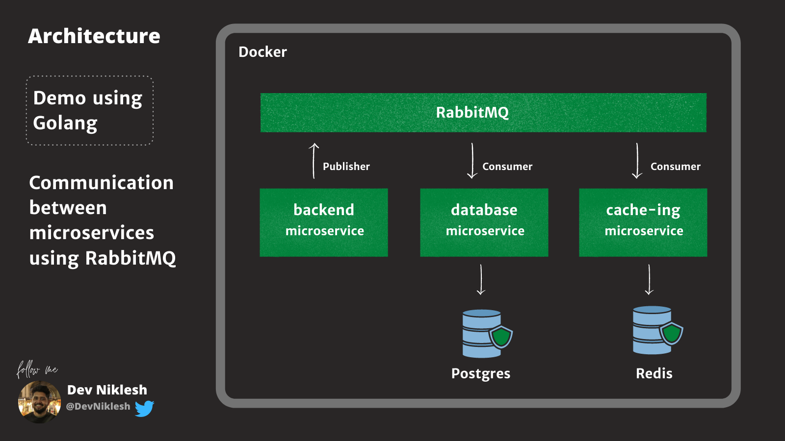

# Golang Messenger using RabbitMQ & Redis 



## To run app locally

```bash
git clone https://github.com/DevNiklesh/rabbitmq-postgres-redis-messenger-go.git
cd rabbitmq-postgres-redis-messenger-go
```
```bash
docker-compose up
```

## To send a message
Open a new terminal and run

```bash
docker attach microserivce_backend
```
Start sending message from terminal
```bash
hello from backend
> hello from backend // Result printed here
```


## To see message in Database

```bash
docker run -it --rm \
    --network messengers_ms_network \
    postgres:13-alpine \
    psql -h postgres -U postgres -d messenger
```
```bash
SELECT * FROM messages;
```